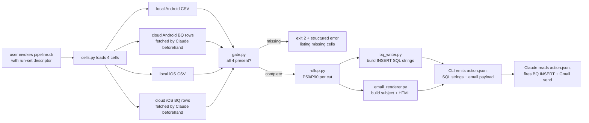

# feat: Maestro benchmark aggregation + email pipeline

## Summary

A Claude-MCP-orchestrated pipeline that gates on completion of the four-cell Maestro benchmark matrix (local-Android, cloud-Android, local-iOS, cloud-iOS), unifies cloud session rows from BigQuery with local session CSVs, computes P50/P90 rollups per metric per (Region × Capability profile) cut, writes one aggregated row per cell to a new `maestro_benchmark_metrics_aggregated` BigQuery table, and renders a single consolidated HTML email when manually triggered after a run-set completes.

---

## Problem Frame

Per the *Ideal performance benchmarking - Automation testing* spec (2026-05-04, in `TB.pdf` superseded version) and the user's scope statement:

> *"Capture the P90 and P50 data for the below mentioned metrics and trigger a health report email for each combination of Framework + Region + Platform + capabilities (if enabled). Store aggregated metrics in a BQ table aligned with Ideal Benchmarking doc."*

After the iOS cloud baseline run (build `82920fe249e2dad80a69ba92e5ffc144e0621761`, 100 sessions, see `generated_docs/BENCHMARK_REPORT_IOS_CLOUD.md`), the project has the raw measurement plumbing working but no aggregator and no reporting harness. Today the workflow is: hand-run SQL in Claude → markdown report by hand. The deliverable that closes the spec gap is a re-runnable pipeline that produces the aggregate row in BigQuery and the email in one ad-hoc invocation.

---

## Requirements

- R1. Capture P50 and P90 for these metrics: `waiting_time` (with the four reason buckets), `start_time`, `execution_time` (session duration), `app_download_time + app_install_time`, `stop_time` (NULL surfaced transparently for Maestro)
- R2. Apply cuts on Region (EUW, USE, USW, APS, APSE), Framework (Maestro initially; schema accommodates Espresso / XCUITest), OS, Capabilities profile
- R3. Persist a rollup row per (Cell × Region × Capability profile) into a new BQ table whose name contains "maestro" — placeholder `maestro_benchmark_metrics_aggregated`
- R4. Stored fields on each rollup row include: start / session / stop / waiting times (P50 + P90), region, OS, framework, capabilities profile label, source build/session ids, aggregation timestamp, sample size
- R5. Trigger one consolidated email — ad-hoc only — only when all four cells of the matrix (local-Android, cloud-Android, local-iOS, cloud-iOS) have data for the run-set; refuse and report missing cells otherwise
- R6. Work without requiring a BS BQ service-account JSON or Gmail app password on the user's machine — orchestrate I/O through Claude's already-authenticated BigQuery and Gmail MCP connectors
- R7. Match the email format requirements in the new spec PDF: capability info in the subject line, P90 default + P50 aggregated in the body, regions × platform grouping

---

## Scope Boundaries

- HyperExecute coverage and Bstack-vs-HE comparison (mentioned in new PDF — separate plan)
- Backfilling or re-running missing benchmark cells — pipeline aggregates what exists; user runs missing cells separately
- Fixing the source-side `total_stop_time = NULL` for Maestro at BS data-pipeline level
- Competitor data ingestion (LT, Sauce)
- Espresso (Android) and XCUITest (iOS) frameworks — table schema accommodates them as future cuts; this plan does not implement their loaders or formatters
- Scheduled / recurring triggers — explicitly excluded per scope clarification
- Admin dashboard with on-demand triggers (new-PDF stretch goal)
- Per-Maestro-command timing extraction from S3 session terminal logs (separate plan; flagged as recommendation A5 in the iOS report)
- Modifying the trigger orchestrators (`run_benchmark.sh`, `cloud_run_ios.sh`)
- Building or deploying a long-lived service — this is a one-shot CLI invocation per run-set

### Deferred to Follow-Up Work

- Service-account-based standalone mode (so the script can run outside a Claude session): defer until a real ops need exists
- Per-command Maestro log parsing on cloud (S3 fetch + parse): separate plan
- Template-based email customization (multiple templates, per-recipient): defer until first recipients other than the author exist

---

## Context & Research

### Relevant Code and Patterns

- `aggregate_results.py` — local-side P50/P90 aggregator over `results/sessions.csv`. Establishes the percentile / stats convention this plan reuses.
- `parse_maestro_log.py` — local Maestro log parser. Establishes the JSON-emitting convention.
- `cloud_run_ios.sh` — single-build orchestrator with the BQ-friendly trigger payload. Source of `build_id` per run-set.
- `run_benchmark.sh` — local Android orchestrator that writes to `results/sessions.csv`. Source of local-cell rows.
- `results/cloud_20260504_163420/cloud_baseline_ios_per_session.tsv` — example cloud-cell shape after BQ-pull (TSV).

### Institutional Learnings

- BQ ingestion lag for Maestro sessions on this account is ~50 minutes after session end (observed during the 100-session iOS run). Aggregator must wait or fail clearly when rows haven't landed.
- BS does not dedupe duplicate device entries in the `devices` array of one Maestro v2 build payload — confirmed via the verification build. Single-build-multi-session is the canonical shape for this project; rollups should use `build_id` as the run-set identity.
- `total_stop_time` is NULL for every Maestro session in BQ — propagate as NULL; do not invent a proxy. (Recorded in `generated_docs/BENCHMARK_REPORT_IOS_CLOUD.md` §6.1 A4.)
- Cross-region device allocation happens during high-parallelism bursts (28 % of the iOS run scattered outside `ap-south-1` despite the user being in IND). The aggregator must group by `device_region`, not user region.

### External References

- `TB.pdf` (original spec, 2026-04-27): metric definitions and reason-bucket taxonomy.
- `PROD-Ideal performance benchmarking - Automation testing-040526-170146.pdf` (2026-05-04): updated reporting-format requirements (BQ table fields, email subject convention, region × platform grouping).
- BS BQ schema: `browserstack-production.app_automate.app_automate_test_sessions_partitioned` (read-only via Claude MCP).
- BS BQ queueing: `browserstack-production.app_automate.app_automate_queueing_data_partitioned` (waiting-time reason buckets).

---

## Key Technical Decisions

- **Architecture: Claude-MCP-orchestrated, not standalone Python service.** A pure-Python `pipeline/` module owns the aggregation, gating, and templating logic and works on JSON / CSV inputs the caller provides. The Claude session does the BQ reads, BQ writes, and Gmail send through the already-authenticated MCP tools, calling into the Python module between them. Rationale: the user has no `gcloud` / no BS BQ service-account / no Gmail app password locally, so a standalone script would require non-trivial credential provisioning that's out of scope. Claude-MCP orchestration uses the auth that already exists in this session.
- **Run-set identity = `build_id` (cloud) and `run_id` (local timestamp dir)**: the aggregator takes a run-set descriptor as input listing one or two cloud `build_id`s and one or two local `run_id`s, then loads the four cells from there. Avoids time-window heuristics that mis-bucket overlapping runs.
- **One BQ row per (Cell × Region × Capability profile)**, not one per cut combo with all metrics. Long-format makes cross-run comparison and SQL aggregation cleaner than wide-format.
- **Email gate semantics: hard-block on missing cells**, with a structured error listing what's missing. Soft-warn on small sample size (n < 30) — surface the warning in the email body but still send.
- **Stop-time NULL handling: propagate**, not impute. Schema column is NULLABLE; email cell shows `—` with a footnote linking to the known data-pipeline gap.
- **Test framework: `pytest`** introduced for this module. Repo had no test framework before; pytest is small, stdlib-adjacent, and the rollup logic deserves real unit tests because it's the core artifact. Add to a `requirements-dev.txt`.

---

## Open Questions

### Resolved During Planning

- **Where do BQ writes come from?** The Claude session, via `mcp__claude_ai_Google_Cloud_BigQuery__execute_sql` (the read-only MCP only allows SELECT; the full `execute_sql` MCP allows DDL/DML). Both are present in the available toolset.
- **Where does the email send come from?** Gmail MCP (`mcp__claude_ai_Gmail__authenticate` and post-auth `send_message`-style tools). The user authenticates Gmail in the same session they trigger the report.
- **Local data lives where?** `results/sessions.csv` for local Android (already produced by `run_benchmark.sh`) and a yet-to-be-created `results/<run_id>/sessions.csv` for local iOS. The aggregator reads CSV directly, no BQ join needed for the local cells.

### Deferred to Implementation

- **Exact BQ table name** — `maestro_benchmark_metrics_aggregated` is the placeholder; final name confirmed with BS data team during U1 implementation.
- **BQ partitioning column** — likely `aggregated_at` (TIMESTAMP) DAY-partitioned, but verify against the data team's table conventions before CREATE.
- **HTML email template structure** — start with a single-table summary + per-cell detail; refine after seeing the first rendered output.
- **Recipient list and from-address** — starts with the author; expand once the format settles.
- **What capability profiles exist beyond `defaults`** — discovered during U2 / U3 as we read `input_capabilities` from real builds.

---

## Output Structure

```
/Users/vinits/perf_bench_maestro/
├── pipeline/                                  ← new module
│   ├── __init__.py
│   ├── cells.py                               ← cell loaders (local CSV + cloud BQ JSON)
│   ├── rollup.py                              ← P50/P90 + percentile math
│   ├── gate.py                                ← four-cell completeness check
│   ├── bq_writer.py                           ← DDL + INSERT SQL builders (no execution; SQL strings out)
│   ├── email_renderer.py                      ← HTML template + subject builder
│   └── cli.py                                 ← argparse entrypoint that emits a "plan" JSON describing
│                                                  what BQ ops + email payload Claude should fire
├── tests/                                     ← new
│   ├── __init__.py
│   ├── fixtures/
│   │   ├── cloud_ios_sample.json              ← captured BQ rows for one cell
│   │   └── local_android_sample.csv           ← captured local sessions for one cell
│   ├── test_rollup.py
│   ├── test_gate.py
│   ├── test_bq_writer.py
│   └── test_email_renderer.py
├── docs/
│   ├── plans/
│   │   └── 2026-05-04-001-feat-maestro-benchmark-pipeline-plan.md
│   └── runbooks/
│       └── benchmark-report.md                ← how to trigger the pipeline + send the email
├── requirements-dev.txt                       ← new (pytest only for now)
└── (existing files unchanged)
```

---

## High-Level Technical Design

> *This illustrates the intended approach and is directional guidance for review, not implementation specification. The implementing agent should treat it as context, not code to reproduce.*

### Data flow



### Run-set descriptor

A JSON file the user constructs (or a CLI flag set) naming the four cells:

```
{
  "run_set_id": "2026-05-04-baseline",
  "cells": {
    "local_android": { "results_dir": "results/20260430_175317" },
    "cloud_android": { "build_id": null },
    "local_ios":     { "results_dir": null },
    "cloud_ios":     { "build_id": "82920fe249e2dad80a69ba92e5ffc144e0621761" }
  },
  "capability_profile": "defaults"
}
```

Empty values cause the gate to fail.

### BQ table shape

| column | type | role |
|---|---|---|
| `run_set_id` | STRING REQUIRED | groups all rollup rows from one invocation |
| `cell` | STRING REQUIRED | `local_android` / `cloud_android` / `local_ios` / `cloud_ios` |
| `framework` | STRING REQUIRED | `maestro` (for now) |
| `os` | STRING REQUIRED | `android` / `ios` |
| `region` | STRING NULLABLE | BQ's `device_region`; NULL for local cells |
| `capabilities_profile` | STRING REQUIRED | `defaults` / `local_on` / `network_logs_on` / … |
| `source_build_ids` | ARRAY<STRING> | for cloud cells |
| `source_run_ids` | ARRAY<STRING> | for local cells |
| `n_sessions` | INTEGER REQUIRED | sample size |
| `waiting_p50_ms`, `waiting_p90_ms` | INTEGER NULLABLE | total queue time |
| `waiting_reason_*_p50_ms`, `_p90_ms` | INTEGER NULLABLE | one set per reason bucket (4 buckets) |
| `start_p50_ms`, `start_p90_ms` | INTEGER NULLABLE | firecmd_time analog |
| `execution_p50_s`, `execution_p90_s` | FLOAT NULLABLE | session duration |
| `app_download_p50_ms`, `app_download_p90_ms` | INTEGER NULLABLE | |
| `app_install_p50_ms`, `app_install_p90_ms` | INTEGER NULLABLE | |
| `stop_p50_ms`, `stop_p90_ms` | INTEGER NULLABLE | NULL for Maestro today |
| `aggregated_at` | TIMESTAMP REQUIRED | DAY-partitioning column |

---

## Implementation Units

- U1. **BQ table DDL + creation**

**Goal:** Create the `maestro_benchmark_metrics_aggregated` BigQuery table with the schema defined above, partitioned by `aggregated_at` (DAY).

**Requirements:** R3, R4

**Dependencies:** None

**Files:**
- Create: `pipeline/bq_writer.py` (DDL builder only at this unit; INSERT comes in U7)
- Test: `tests/test_bq_writer.py`

**Approach:**
- Module-level function `build_create_table_ddl(table_name, project, dataset)` returns a SQL string.
- Caller (Claude session) executes the DDL via `mcp__claude_ai_Google_Cloud_BigQuery__execute_sql` once.
- Confirm final table name with BS data team via Slack / email before executing — this is a one-time operational step the runbook (U8) documents.

**Patterns to follow:**
- N/A (no existing BQ DDL in repo)

**Test scenarios:**
- Happy path: `build_create_table_ddl("foo.bar", project="p", dataset="d")` returns SQL containing `CREATE TABLE`, every column from the schema table, `PARTITION BY DATE(aggregated_at)`.
- Edge case: special characters in table name are rejected (raise `ValueError`).

**Verification:**
- DDL string is executable as-is (validate by running through `execute_sql` `dryRun: true` once table name is confirmed).
- Schema returned by `get_table_info` after creation matches the columns listed in the High-Level Technical Design.

- U2. **Cell loaders for local CSVs**

**Goal:** Load `results/<run_id>/sessions.csv` (local Android, future local iOS) into a normalized in-memory cell representation that the rollup module can consume.

**Requirements:** R1, R2

**Dependencies:** None

**Files:**
- Create: `pipeline/cells.py` (local-CSV loaders only at this unit; BQ loader comes in U3)
- Create: `tests/fixtures/local_android_sample.csv`
- Test: `tests/test_cells.py`

**Approach:**
- One function per cell type: `load_local_android(results_dir)`, `load_local_ios(results_dir)`. Both return the same `Cell` dataclass with rows = list of session dicts in the canonical metric schema (waiting_ms, start_ms, execution_s, app_dl_ms, app_install_ms, stop_ms, region=None, capability_profile from results metadata).
- Reuse the column conventions in `aggregate_results.py` so existing local results "just work".
- Capability-profile derivation: read from a `meta.txt` or default to `defaults`.

**Patterns to follow:**
- `aggregate_results.py` — column names, percentile math conventions
- `parse_maestro_log.py` — JSON I/O conventions

**Test scenarios:**
- Happy path: load from `tests/fixtures/local_android_sample.csv`; row count and column normalization match expected.
- Edge case: missing `meta.txt` defaults `capability_profile` to `defaults`.
- Error path: empty CSV raises `EmptyCellError`.

**Verification:**
- Loader output round-trips through `rollup.compute()` without exceptions.

- U3. **Cell loader for cloud BQ rows**

**Goal:** Convert the BQ-row JSON shape (as returned by `mcp__claude_ai_Google_Cloud_BigQuery__execute_sql_readonly`) into the same `Cell` shape produced by U2.

**Requirements:** R1, R2

**Dependencies:** U2 (`Cell` dataclass)

**Files:**
- Modify: `pipeline/cells.py`
- Create: `tests/fixtures/cloud_ios_sample.json` (a captured BQ response from this session's iOS run)
- Test: `tests/test_cells.py`

**Approach:**
- `load_cloud_cell(bq_response_json, os, framework="maestro")` parses the `rows[].f[].v` JSON path into the canonical metric schema.
- Pull region from `product.performance.device_region`.
- Pull capability profile from `input_capabilities` at the build level (input parameter to the loader).
- Maestro's `total_stop_time` is NULL → emit `stop_ms=None`.

**Patterns to follow:**
- `cloud_run_ios.sh` — establishes the build/session JSON shape conventions
- The aggregation SQL in `generated_docs/BENCHMARK_REPORT_IOS_CLOUD.md` §4.1 — establishes which BQ fields populate which canonical metric

**Test scenarios:**
- Happy path: fixture parses, row count matches, capability profile from input is propagated, region values match expected set.
- Edge case: row with `data` JSON missing some keys still loads (NULL fields).
- Error path: malformed BQ response raises `MalformedCellError`.

**Verification:**
- A round-trip from `tests/fixtures/cloud_ios_sample.json` produces the same n=99 cell that the iOS report aggregates.

- U4. **Four-cell completeness gate**

**Goal:** Before any rollup or email work, confirm the four-cell matrix has data; otherwise report exactly what's missing.

**Requirements:** R5

**Dependencies:** U2, U3

**Files:**
- Create: `pipeline/gate.py`
- Test: `tests/test_gate.py`

**Approach:**
- `check(run_set) -> GateResult` returns either `Complete` or `Incomplete(missing_cells, partial_cells)`.
- "Missing" = cell points at a path / build_id that doesn't exist or has zero sessions.
- "Partial" = cell exists but has n < 30 — soft warning, not a block.

**Patterns to follow:**
- N/A

**Test scenarios:**
- Happy path: all 4 cells with n ≥ 30 → `Complete`.
- Edge case: one cell with n=5 → `Complete` with `partial=[that cell]` (warning, not block).
- Error path: `local_ios` points at non-existent dir → `Incomplete(missing=['local_ios'])`.
- Error path: `cloud_ios` build_id has no sessions in fixture → `Incomplete(missing=['cloud_ios'])`.

**Verification:**
- Gate's `Incomplete` message lists each missing cell on its own line with the descriptor it expected.

- U5. **Rollup math (P50 / P90 / per-cut)**

**Goal:** Compute the percentile rollups per (Cell × Region × Capability) cut, plus run-set-level totals, in a stable nearest-rank percentile convention.

**Requirements:** R1, R2, R4

**Dependencies:** U2, U3

**Files:**
- Create: `pipeline/rollup.py`
- Test: `tests/test_rollup.py`

**Approach:**
- `rollup(cells, run_set_id) -> List[RollupRow]` returns one row per (cell, region, capability) cut.
- Percentile method: nearest-rank (matches the local `aggregate_results.py` and the Python convention used in the iOS report).
- Skip cuts with `n < 5` (too small to compute P50/P90 meaningfully) — emit them as NULL P50/P90 with `n` populated and a `low_sample` flag.
- Stop time stays NULL for Maestro cells without imputing.

**Patterns to follow:**
- `aggregate_results.py:stats()` and `percentile()` functions
- `parse_maestro_log.py` JSON convention for output

**Test scenarios:**
- Happy path: synthetic input of [100,200,300,400,500] yields P50=300, P90=500 (nearest-rank).
- Edge case: cell with all NULL stop_ms → rollup row's stop fields are NULL, n_sessions still populated.
- Edge case: cut with n=3 → low_sample flag set, P50/P90 NULL.
- Edge case: empty cell after filtering → row not emitted (no zero-n rows).
- Integration: 99-session iPhone 17 fixture matches the percentiles already in `generated_docs/BENCHMARK_REPORT_IOS_CLOUD.md` §4.1 (P50 720, P90 810 for execution).

**Verification:**
- Output schema fields exactly match the BQ table column list in High-Level Technical Design.

- U6. **BQ insert builder**

**Goal:** Translate `RollupRow`s into `INSERT INTO` SQL strings ready for the Claude session to execute through the BQ MCP.

**Requirements:** R3, R4

**Dependencies:** U1 (DDL defines target schema), U5 (RollupRow shape)

**Files:**
- Modify: `pipeline/bq_writer.py`
- Test: `tests/test_bq_writer.py`

**Approach:**
- Module-level `build_insert_sql(table, rollup_rows) -> str` returns one parameterized INSERT (or a small batch) using BigQuery-safe literal escaping for STRING / TIMESTAMP / ARRAY columns.
- Reject NULL on REQUIRED columns; emit NULL on NULLABLE columns with no value.

**Patterns to follow:**
- N/A

**Test scenarios:**
- Happy path: 4 rollup rows produce one INSERT with 4 VALUES tuples; column order matches the DDL exactly.
- Edge case: row with `source_build_ids=[]` produces `[]` in SQL, not NULL.
- Edge case: stop_p50 = NULL emits `NULL` literal, not `'None'` string.
- Error path: missing `aggregated_at` raises `MissingRequiredColumnError`.

**Verification:**
- Output SQL parses successfully via `execute_sql` `dryRun: true` against the live (post-U1) table.

- U7. **HTML email renderer + subject builder**

**Goal:** Render the consolidated email — subject line per the new-PDF requirement (capability info embedded) and HTML body covering the four cells with summary table on top, per-cell breakdown below.

**Requirements:** R5, R7

**Dependencies:** U5

**Files:**
- Create: `pipeline/email_renderer.py`
- Test: `tests/test_email_renderer.py`

**Approach:**
- `build_subject(run_set_id, capability_profile, status) -> str` returns e.g. `"Maestro Benchmark / 2026-05-04-baseline / defaults / 4-cell complete"` or `… / incomplete (missing local_ios)`.
- `build_html(rollup_rows, gate_result) -> str` uses string-template HTML (no jinja dep) — header, summary table (Cell × main metric P90), per-cell tables (Region rows × full metric set), footer with build/run-set ids and BQ link.
- Stop-time cells render as `—` with a footnote linking to recommendation A4 in the iOS report.

**Patterns to follow:**
- `generated_docs/BENCHMARK_REPORT_IOS_CLOUD.md` — table layout and cell labelling
- New PDF reporting format requirements (subject convention, P90 default + P50 aggregated)

**Test scenarios:**
- Happy path: 4 complete cells render summary + per-cell tables; subject contains capability profile, run_set_id, status.
- Edge case: cell with low_sample flag adds a "(n=12)" annotation.
- Edge case: cell with all-NULL stop_p50 renders `—` with footnote.
- Integration: rendered HTML opens cleanly in a browser (visual check, not test).
- AE: subject line matches the new-PDF requirement to embed capability info.

**Verification:**
- `pytest -k email` passes.
- A rendered fixture HTML file under `tests/fixtures/expected_email.html` matches the renderer output for the iOS-only-cell happy path.

- U8. **CLI entrypoint + runbook**

**Goal:** Tie U2–U7 into a single CLI invocation that takes the run-set descriptor JSON, runs the gate, computes rollups, and emits an `action.json` containing the BQ INSERT SQL + email payload (subject + HTML body + intended recipients) for the Claude session to execute.

**Requirements:** R5, R6

**Dependencies:** U2, U3, U4, U5, U6, U7

**Files:**
- Create: `pipeline/cli.py`
- Create: `pipeline/__init__.py`
- Create: `docs/runbooks/benchmark-report.md`
- Create: `requirements-dev.txt` (pytest)
- Test: `tests/test_cli.py`

**Approach:**
- `python -m pipeline.cli --run-set path/to/run_set.json --out action.json`.
- On gate failure: exit code 2, `action.json` contains the structured error (no SQL, no email).
- On gate success: exit code 0, `action.json` contains `bq_insert_sql` + `email.subject` + `email.body_html` + `email.recipients`.
- Runbook (`docs/runbooks/benchmark-report.md`) walks through: (1) run benchmark cells, (2) prepare `run_set.json`, (3) `python -m pipeline.cli ...`, (4) in Claude session, fire the BQ INSERT + Gmail send using the contents of `action.json`.

**Patterns to follow:**
- `run_benchmark.sh`, `cloud_run_ios.sh` — exit-code conventions, log-friendly stdout
- `generated_docs/SESSION_LIFECYCLE_EXPLAINED.md` — runbook tone

**Test scenarios:**
- Happy path: all 4 cells complete → `action.json` has both SQL and email keys; exit code 0.
- Edge case: one cell missing → `action.json` has `error.missing_cells = [...]`; exit code 2; no SQL, no email.
- Edge case: `--dry-run` flag prints the action plan to stdout without writing the file.
- Integration: end-to-end run with the four fixture cells produces an `action.json` whose SQL parses successfully (dry-run) and whose HTML opens in a browser.

**Verification:**
- `pytest tests/` passes (full suite).
- Manual run of `python -m pipeline.cli --run-set tests/fixtures/run_set_full.json --out /tmp/a.json` produces a valid action plan; the runbook's steps work end-to-end.

---

## System-Wide Impact

- **Interaction graph:** No new callbacks or middleware. The pipeline reads from the filesystem and BQ-fetched JSON; writes to the filesystem and (via Claude MCP) to BQ + Gmail.
- **Error propagation:** Gate failures, malformed cell data, and rollup errors all result in non-zero exit codes from the CLI plus structured `action.json.error` payloads. No silent fallback to partial data.
- **State lifecycle risks:** None significant — the pipeline is stateless. The new BQ table is append-only; re-running the pipeline for the same `run_set_id` would create duplicate rows. Mitigation: the runbook tells the user to choose unique `run_set_id`s; future hardening can add an `INSERT … WHERE NOT EXISTS` pattern.
- **API surface parity:** The pipeline outputs `action.json` in a stable schema; the Claude-session caller is the only consumer. Schema changes need a versioned key.
- **Integration coverage:** The end-to-end test in U8 covers the full flow on fixtures. Live BQ DDL and Gmail send remain manual operational steps, validated once during U1 / U7's "verification" steps.
- **Unchanged invariants:** The existing trigger orchestrators (`run_benchmark.sh`, `cloud_run_ios.sh`) are not modified. Their CSV / build-payload outputs remain the source of truth for cell data; the pipeline only consumes them.

---

## Risks & Dependencies

| Risk | Mitigation |
|---|---|
| BQ table name policy at BS data team conflicts with `maestro_benchmark_metrics_aggregated` | Confirm name with data team before U1 execution; runbook documents the confirmation step. |
| Gmail MCP send returns rate-limit / auth error mid-flow | `action.json` is the durable artefact — even if email fails, the operator can re-attempt the send from the captured payload without re-running aggregation. |
| Source `total_stop_time` NULL for Maestro persists indefinitely | Email cell shows `—` with footnote; not a blocker. Recommendation A4 in the iOS report tracks the upstream fix. |
| BQ ingestion lag causes the cloud-cell loader to under-count | Runbook tells operator to wait at least 60 minutes after last session before triggering. Future hardening: explicit pre-flight count check inside the gate. |
| Re-running for the same `run_set_id` duplicates BQ rows | Runbook + a `MERGE`-style or `WHERE NOT EXISTS` clause as a future hardening unit. |
| Local iOS cell never runs (user previously deferred local iOS) | Out of scope for this plan; the gate will block cleanly and tell the user what's missing. |

---

## Documentation / Operational Notes

- Runbook in `docs/runbooks/benchmark-report.md` (U8) describes the trigger flow.
- The plan-vs-deliverable boundary is the `action.json`: pipeline writes it; Claude session fires it. Runbook makes this explicit.
- Future addition: when a recurring cadence is desired, swap the manual Claude-session firing for a `gh action` or service-account-based runner without changing the Python module.

---

## Sources & References

- Original spec: `TB.pdf` at the project root.
- New spec: `PROD-Ideal performance benchmarking - Automation testing-040526-170146.pdf` at the project root.
- Earlier deliverables: `generated_docs/BENCHMARK_REPORT_IOS_CLOUD.md`, `generated_docs/PHASE_DEFINITIONS.md`, `generated_docs/SESSION_LIFECYCLE_EXPLAINED.md`.
- BQ schema reference: `browserstack-production.app_automate.app_automate_test_sessions_partitioned`.
- Existing aggregator (pattern source): `aggregate_results.py`.
